# 基于用户身份信息的凭证调整攻击优化方法

## 1.凭证调整攻击

凭证调整攻击假设攻击者能够获取到用户的真实登录凭证，使用将凭证中的口令替换为用户可能重用的口令，并攻击该用户在其他网站的账户。
由于用户重用口令的概率很高，当前凭证调整攻击成为用户账户安全的重要威胁。

> 参考网站：
> + [HIBP](https://have-ibeenpwned.com/Passwords.html)：检查你的正在使用的口令是否已经被泄露。
> + [Google Passwords Checkup](https://blog.google/technology/safety-security/password-checkup/)：内置于浏览器的口令泄露检测工具。
> + [Might I Been Pwned](https://github.com/islamazhar/MIGP_python)：检查你的正在使用的口令能够直接或间接的被已泄露的口令破解。

## 2.用户身份信息

在凭证调整攻击中，攻击者能够获取用户已经泄露的口令已经该用户的身份信息。
其中，用户的身份信息仅仅被用于识别用户的身份，即作为登录网站的用户名使用。
但是，我们发现，通过用户身份信息（主要为邮箱），攻击者能够进一步识别用户创建口令时使用的策略。
具体来说，攻击者能假设用户会将邮箱地址中的用户名信息作为口令。
此外，邮箱信息中的地域信息（顶级域名）也能够帮助攻击者推断用户所处的地域，并进一步约束用户创建口令的策略。

## 3.模型架构

编码器包含两个部分：用户信息编码器和口令信息编码器。
在RNN模型的基础上，使用用户信息初始化RNN编码器的状态（包括隐藏状态和细胞状态）。
用户信息编码器通过一个嵌入层来实现。
口令信息编码器将用户泄露的口令作为输入，产生的编码包括用户信息以及用户口令信息。
最后，编码结果作为解码器的初始状态，解码器通过Beam Search产生N个字符级编辑操作序列。
这些编辑操作序列作用于源口令上即产生猜测口令。

## 运行

核心代码位于`src/code`中。
+ `src/code/pitg_model.py`：模型架构文件。
+ `src/code/pitg_trainer.py`：训练PITG模型的脚本。
+ `src/code/pitg_evaluator.py`：使用PITG模型猜测口令的脚本。

其中，训练数据文件的格式为`邮箱地址\t源口令\t目标口令`，查询数据的格式为`邮箱地址\t源口令\t目标口令`。
查询结果表示为模型猜测口令所需要的猜测数，未猜中则设置为-1.

## 其他

我们也参照相关论文实现了Das等人的算法和Wang等人的TarGuess-II，代码位于`src/baseline`中。

